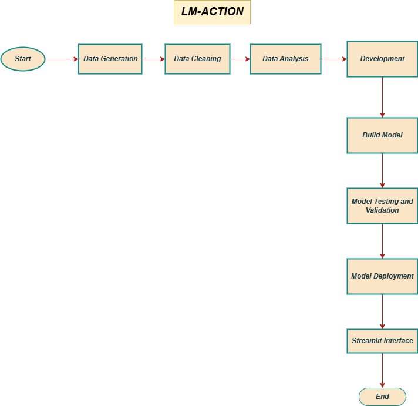

# LM-ACTION: Task Classifier for a Large Action Model

**Final Data Science Project - Le Wagon**

**Team Members:**
- [@FarisZahrani](https://github.com/FarisZahrani) | Lead Developer
- [@AlsaediAmro](https://github.com/AlsaediAmro) | Data Analyst Engineer
- [@raydbasa](https://github.com/raydbasa) | Deep Learning Engineer
- [@AbdulazizAllahw](https://github.com/AbdulazizAllahw) | Research & Development Engineer

---

## 📋 Contents
1. **Introduction**
2. **Demo**
3. **Data Generation**
4. **Project Life Cycle Diagram**
5. **Analysis**
6. **Development**
7. **Modeling**
8. **Conclusion**

---

## 1. Introduction
In this project, we developed a Task Classification Model for the Large Action Model (LAM) using BERT. BERT is a powerful language model that comprehends the context of words in natural language, making it ideal for classification tasks. LAM is an AI system designed to interpret natural language commands and convert them into executable actions on a computer.

---

## 2. Demo
You can access the task classifier demo here: (https://lam-task-classifier-demo.streamlit.app/)

---

## 3. Data Generation
We generated over +22,000 tasks using both local and API-based LLMs, implementing auto-balancing for data distribution:

### Local LLM Data Generation:
- LLaMA-3.1-8B-Instruct
- Hermes-3-Llama-3.1-8B

### API LLM Data Generation:
- Gemini-1.5-Pro
- ChatGPT-4o
- Claude-3.5-Sonnet
- ChatGPT-4o-Mini

**Data Cleaning:** We utilized LLMs to remove duplicates and developed a Database Manager for handling multi-job processing.

---

## 4. Project Life Cycle Diagram
*Below is the project life cycle diagram that outlines the process from data generation to deployment:*

---

## 5. Analysis
- **Data Analysis:** Ensured that data aligns with our schema and objectives.
- **What-If Analysis:** Explored the potential impact of various approaches on the data.
- **Feature Analysis:** Ensured consistency between task features and actions.
- **Data Cleaning:** Produced two files—one ready for immediate use and another requiring further processing.

---

## 6. Development
This section outlines the data lifecycle from generation to application development:

- We started by generating reliable data from multiple LLMs, merging it, and ensuring consistency.
- We maintained data integrity through manual and automated cleaning, employing LLMs for complex cases.
- Once cleaned, we stored the data in a database and applied feature engineering for insights.
- To balance data for model training and reduce bias, we utilized prompt engineering to enhance data generation.
- Finally, we trained the model and deployed it in the application for user interaction.

---

## 7. Modeling
We employed BERT as a base model to classify tasks based on the following criteria:
- **Feasibility and Legality**
- **Ethicality and Boundaries**
- **Reversibility and Risk Level**

To improve model performance, we applied:
- Text augmentation and focal loss
- Gradient accumulation and learning rate scheduling
- Early stopping to enhance model performance

### Future Improvements:
- Multi-lingual support (e.g., Arabic and other languages).
- Wider data range to further enhance model accuracy.

---

## 8. Conclusion
The LM-ACTION project successfully developed a robust Task Classification Model leveraging BERT, enabling the interpretation of natural language commands into executable actions. By generating a diverse dataset and applying sophisticated modeling techniques, we have laid the groundwork for future enhancements, including multi-lingual support and expanded data coverage, which can significantly improve the model's accuracy and usability. The integration of this classifier into the LAM system positions it as a valuable tool in the realm of AI-driven task execution.

---

## 9.Presentations 

[Presentations](https://www.canva.com/design/DAGUwiQ5zxo/TUJHecLCwN0DxwpzFq3akg/edit?utm_content=DAGUwiQ5zxo&utm_campaign=designshare&utm_medium=link2&utm_source=sharebutton)
